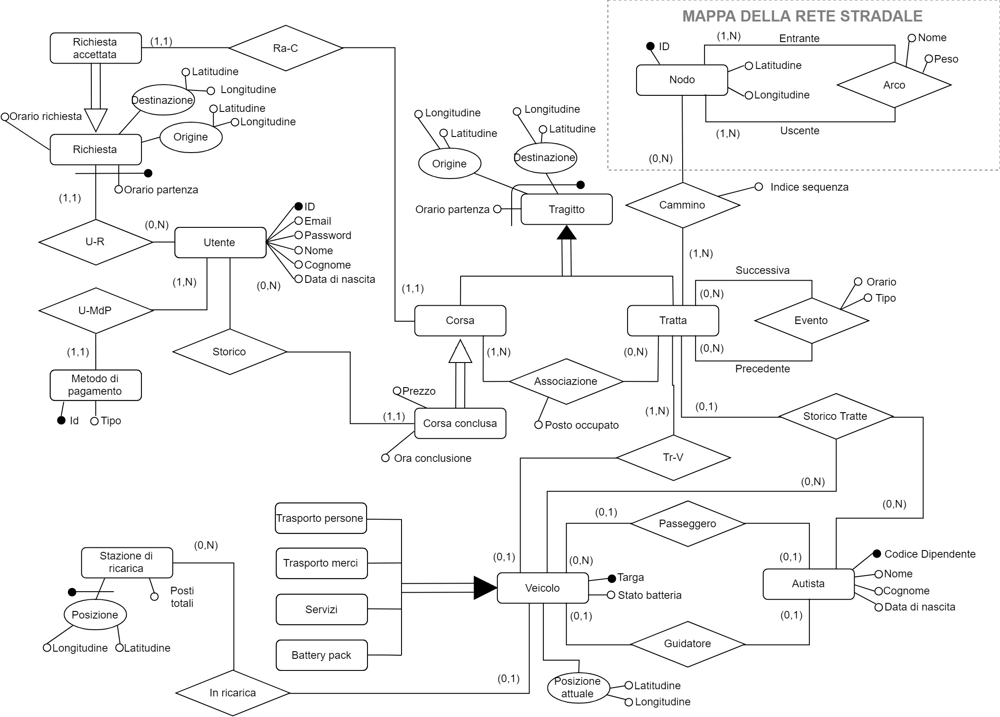
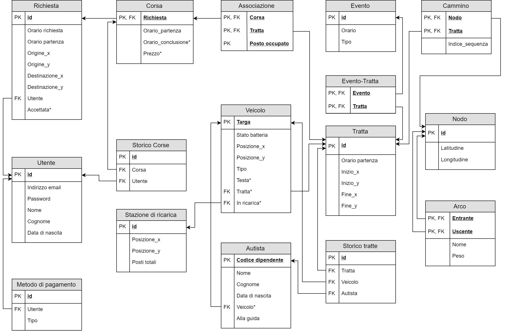

# Databases fundamentals CS course project @ University of Padua

This repo contains the source files of the project I made together with [Marco](https://github.com/jjocram) for an exam.

## The project

We tried to model (with *many* simplifying assumptions) the data collected during the operativity of a fleet of modular dynamic ride sharing (mDRS) vehicles such as those proposed by [Next Future Transportations](https://www.next-future-mobility.com/).

## Design phase result

## Translation to relational model
